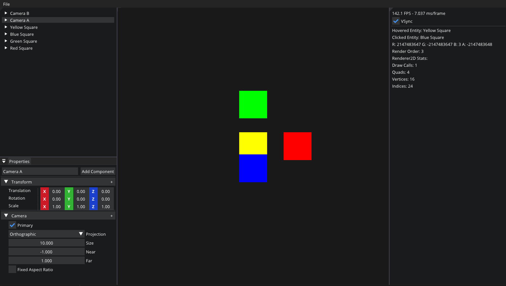
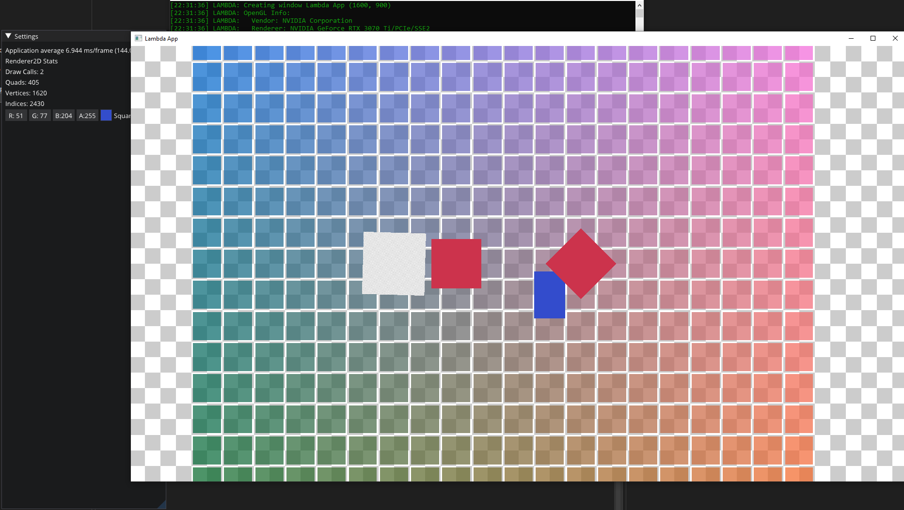
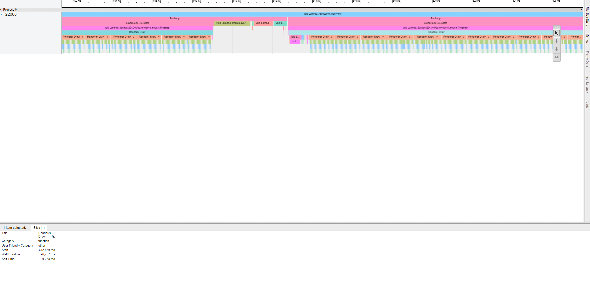

# Lambda (WIP Game Engine)

### This project was developed for educational purposes, mainly by watching [a YouTube playlist](https://www.youtube.com/playlist?list=PLlrATfBNZ98dC-V-N3m0Go4deliWHPFwT) from [TheCherno](https://www.youtube.com/@TheCherno)

### Lambda Editor

### Lambda Sandbox App

### Visual Profiler(Using JSON output in Google Chrome tracing)

## Features
- 2D OpenGL Renderer
- Batch Rendering
- Visual Profiling
- Event Component System (EnTT)
- GUI (Dear ImGui)
- Mouse Picking using Framebuffer and ComponentID

## External Libraries
- [Glad](https://glad.dav1d.de/)
- [GLFW](https://github.com/glfw/glfw)
- [GLM](https://github.com/g-truc/glm)
- [Dear ImGui](https://github.com/ocornut/imgui)
- [stb_image](https://github.com/nothings/stb)
- [EnTT](https://github.com/skypjack/entt)
- [spdlog](https://github.com/gabime/spdlog)

## Dependencies
- [Premake](https://premake.github.io/)